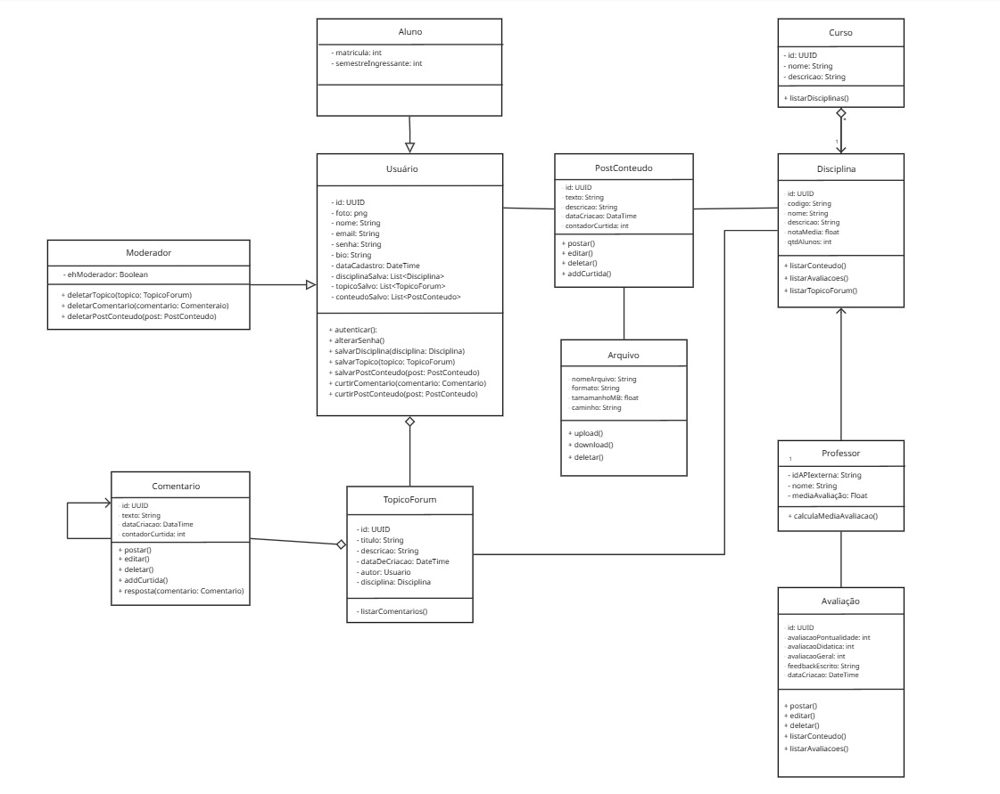

# 2.1.1. Diagrama de Classes

##  Descrição
O Diagrama de Classes é uma representação da estrutura estática do sistema **TenhoUmaDica**. Ele descreve as classes que compõem o software, seus atributos, métodos e como os objetos se relacionam entre si. Este diagrama é fundamental para a transição entre o levantamento de requisitos e a implementação técnica, fornecendo um blueprint para o desenvolvimento em Software Engineering.

##  Objetivo
O objetivo deste artefato é modelar a lógica de dados e o comportamento das entidades do sistema. Através dele, definimos a estrutura dos módulos de **Gamificação**, **Conteúdo (dicas)** e **Avaliação de Professores**, garantindo que as regras de negócio (como a atribuição de pontos) estejam devidamente arquitetadas antes da codificação.

##  Metodologia
A modelagem seguiu a notação UML 2.5, utilizando a ferramenta Miro. O grupo aplicou conceitos de:
* **Visibilidade:** Definição de atributos privados (`-`) e métodos públicos (`+`).
* **Relacionamentos:** Uso de Associações, Composições e Classes Associativas (ex: para Favoritos).
* **Multiplicidade:** Definição clara de cardinalidades (ex: 1 usuário para N dicas).

### Representação Visual

Figura 1: Diagrama de Classes do Projeto

#### Quadro Miro
O diagrama foi feito com a ferramenta Miro seguindo os padrões UML:
<iframe width="768" height="496" src="https://miro.com/app/live-embed/uXjVGg_7_t0=/?focusWidget=3458764669146576602&embedMode=view_only_without_ui&embedId=825195598384" frameborder="0" scrolling="no" allow="fullscreen; clipboard-read; clipboard-write" allowfullscreen></iframe>

##  Bibliografia
* SERRANO, Milene. **Módulo Notação UML - Modelagem Estática**. UnB Gama, 2026.

##  Nível de Contribuição dos Integrantes
Conforme exigido, a tabela abaixo detalha a participação dos membros neste artefato específico.

| Aluno  | Participação|
| -- | -- |
|  [Angélica](https://github.com/angelicaccampos) |  Criação da documentação e Participação na realização do diagrama|
|  [Brenda](https://github.com/Brwnds) |  Participação da versão 1 e validação da versão 2|
| [Marcos Bezerra](https://github.com/marcoslbz) |  Criação da versão 2 do diagrama e validação da versão final|
|  [Gabriel Augusto](https://github.com/gabrielaugusto23) |  Criação da versão final do diagrama|

##  Histórico de versão

| Versão | Descrição | Autor(es) | Data |
| :----: | :--- | :--- | :---: |
| 1.0 | Estruturação inicial do documento MD. | [Angélica](https://github.com/angelicaccampos) | 20/04/2026 |
| 1.1 | Adição das imagens do diagrama, adição da tabela de participações | [Marcos Bezerra](https://github.com/marcoslbz) | 24/04/2026 |