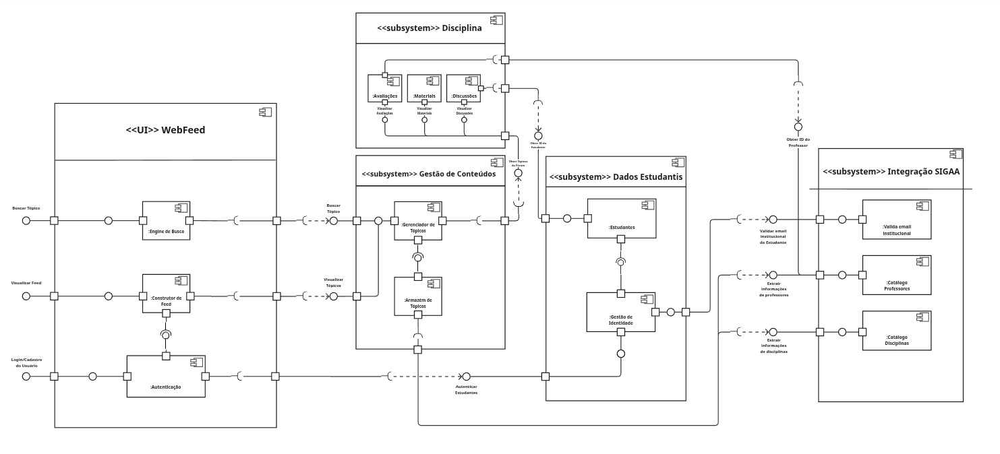

# 2.1.2. Diagrama de Componentes

## Descrição

O Diagrama de Componentes é classificado como um diagrama estrutural e estático da UML[cite: 47, 51]. Ele é utilizado para representar a organização modular do sistema, ilustrando as dependências estruturais e as conexões entre os componentes de diferentes subsistemas. Este diagrama permite visualizar detalhadamente as relações de dependência ("quem requer") e realização ("quem oferece") entre as partes físicas e lógicas do software.

## Objetivo

O objetivo deste artefato é modelar a arquitetura técnica do **Fórum Universitário UnB**, evidenciando a separação típica de uma arquitetura Cliente-Servidor. Através dele, definimos a integração entre os subsistemas de WebFeed, Conteúdo e Dados Estudantis, estruturando a maneira correta com que os componentes (como o `Gerenciador de Tópicos` e a `Engine de Busca`) expõem e consomem serviços. Isso garante que a plataforma seja modular, coesa e escalável antes da fase de codificação.

## Metodologia

A modelagem seguiu a notação UML padrão para componentes. Foram aplicados os seguintes conceitos estruturais:

- **Interfaces e Portas:** Mapeamento das portas (ports), definindo claramente as interfaces fornecidas (provided interfaces) e as interfaces requeridas (required interfaces) por cada módulo.
- **Conectores:** Utilização de conectores de delegação (delegation connectors) para o fluxo interno e conectores de montagem do tipo bola-e-soquete ("assembly connector ball-and-socket") para interligar componentes dependentes.
- **Dependência e Realização:** Representação de detalhamento onde interfaces intermediam a comunicação entre componentes, mostrando a concretização de serviços.

### Representação Visual

Figura 1: Diagrama de Componentes do Projeto Fórum Universitário UnB

## Bibliografia

- SERRANO, Milene. **AULA - MODELAGEM UML ESTÁTICA**. UnB Gama, 2026.
* UML DIAGRAMS. **UML Component Diagrams**. Disponível em: [https://www.uml-diagrams.org/component-diagrams.html](https://www.uml-diagrams.org/component-diagrams.html). Acesso em: 24/04/2026.

## Nível de Contribuição dos Integrantes

Conforme exigido, a tabela abaixo detalha a participação dos membros neste artefato específico.

| Aluno          | Participação                                   |
| -------------- | ---------------------------------------------- |
| [Diogo Oliveira](https://github.com/Diogo-Olivv) | Criação e Validação do Diagrama de Componentes |
| [João Gabriel](https://github.com/JoaoComTil)   | Criação e Validação do Diagrama de Componentes |
| [Felipe Rodrigues](https://github.com/felipeJRdev)         | Ajuste do diagrama de componentes, inclusão do subsistema integração SIGAA |
| [Renan](https://github.com/rsribeiro1)          | Criação e Validação do Diagrama de Componentes |
| [Gabriel Maciel](https://github.com/GabrielMacielBR)     | Criação e Validação do Diagrama de Componentes |

## Histórico de versão

| Versão | Descrição              | Autor(es)                                          |    Data    |
| :----: | :--------------------- | :------------------------------------------------- | :--------: |
|  1.0   | Criação da Página      | [Diogo Oliveira](https://github.com/Diogo-Olivv)                                     | 24/04/2026 |
|  1.1   | Ajuste na contribuição | [Felipe Rodrigues](https://github.com/felipeJRdev) | 24/24/2026 |
