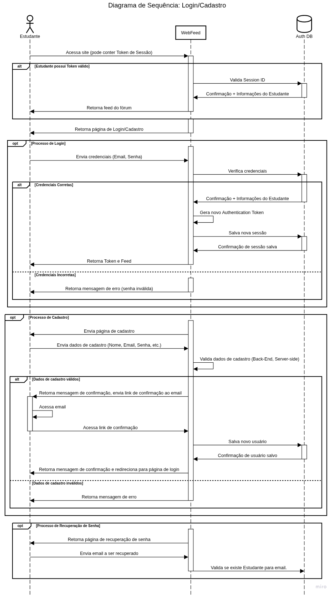
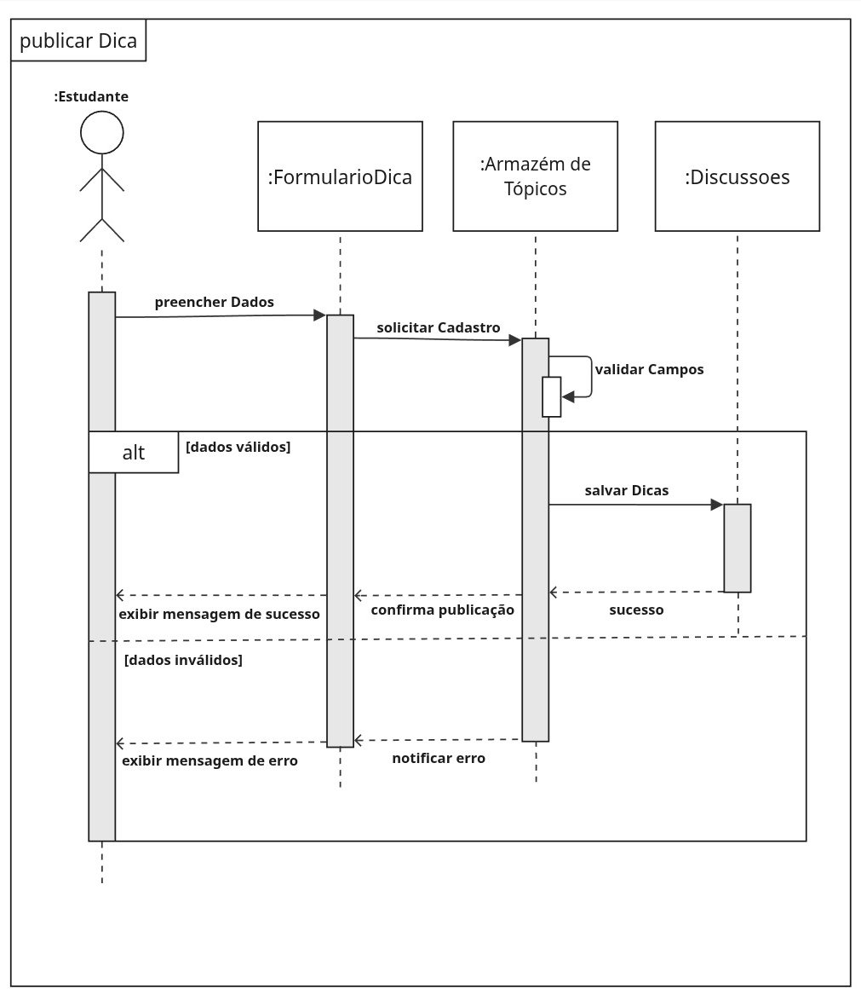

# 2.2.1. Diagrama de Sequência

##  Descrição
O Diagrama de Sequência é uma representação do comportamento dinâmico do sistema, com foco na ordem temporal das interações entre os atores e os objetos que compõem o sistema. Ele descreve, em cada cenário, quais mensagens são trocadas, em que ordem e com quais respostas, evidenciando a colaboração entre as partes para atender a um caso de uso.

Conforme a referência UML Diagrams, o Diagrama de Sequência é o tipo mais comum de Diagrama de Interação e concentra-se na troca de mensagens entre linhas de vida, enfatizando o ordenamento cronológico das comunicações em vez das relações estruturais do sistema. Essa característica o torna especialmente adequado para documentar como os componentes colaboram ao longo do tempo, servindo de apoio à análise de requisitos, ao projeto e à especificação do comportamento do software.

##  Objetivo
O objetivo deste artefato é modelar as principais interações do sistema — Login/Cadastro/Recuperação de Senha e Publicação de Dica — explicitando as mensagens trocadas entre o **Estudante** e os objetos do sistema (WebFeed, Auth DB, FormularioDica, Armazém de Tópicos, Discussões). Dessa forma, buscamos representar o comportamento esperado em cenários válidos e inválidos (alternativas), bem como fluxos opcionais.

##  Metodologia
A modelagem seguiu a notação UML 2.5, utilizando a ferramenta Miro. Com base na fundamentação teórica disponibilizada pela referência UML Diagrams — que lista os elementos essenciais de um Diagrama de Sequência (linhas de vida, especificações de execução, mensagens, fragmentos combinados, usos de interação, invariantes de estado e ocorrências de destruição) — o grupo aplicou os seguintes conceitos na construção dos diagramas:

* **Linhas de Vida (Lifelines)**: Representação dos atores e objetos participantes da interação ao longo do tempo, exibidos como retângulos com uma linha vertical que indica o tempo de vida do participante.
* **Mensagens Síncronas e Assíncronas**: Setas indicando o envio de requisições e respostas entre as linhas de vida, registrando a ocorrência de cada comunicação sobre a linha de vida correspondente.
* **Ativações (Execution Specifications)**: Retângulos sobre as linhas de vida que indicam o período em que um objeto está executando uma operação (comportamento ativo).
* **Mensagens de Retorno**: Setas tracejadas representando respostas às mensagens recebidas.
* **Fragmentos Combinados**:
    * **alt**: Representação de caminhos alternativos com base em condições (ex: credenciais corretas/incorretas, dados válidos/inválidos).
    * **opt**: Representação de fluxos opcionais (ex: processo de login, processo de cadastro, recuperação de senha).
* **Auto-chamadas**: Mensagens que um objeto envia para si mesmo (ex: validação de campos no back-end).

### Diagramas

Figura 1: Diagrama de Sequência de Login, Cadastro e Recuperação de Senha

Figura 2: Diagrama de Sequência de Publicar Dica

#### Quadro Miro dos Diagramas
Todos os diagramas foram feitos no Miro seguindo os padrões UML:
<iframe width="768" height="496" src="https://miro.com/app/live-embed/uXjVGg_7_t0=/?focusWidget=3458764669263387371&embedMode=view_only_without_ui&embedId=773671056833" frameborder="0" scrolling="no" allow="fullscreen; clipboard-read; clipboard-write" allowfullscreen></iframe>

##  Bibliografia
* SERRANO, Milene. **Módulo Notação UML - Modelagem Dinâmica**. UnB Gama, 2026.
* UML DIAGRAMS. **UML Sequence Diagrams**. Disponível em: [https://www.uml-diagrams.org/sequence-diagrams.html](https://www.uml-diagrams.org/sequence-diagrams.html). Acesso em: 24/04/2026.

##  Nível de Contribuição dos Integrantes
Conforme exigido, a tabela abaixo detalha a participação dos membros neste artefato específico.

| Aluno  | Participação|
| -- | -- |
| [Felipe Rodrigues](https://github.com/felipeJRdev) | Criação do Diagrama de Sequência de Publicar Dica |
| [Gabriel Maciel](https://github.com/GabrielMacielBR) | Colaboração no Diagrama de Sequência de Publicar Dica e no de Login/Cadastro |
| [João Gabriel](https://github.com/JoaoComTil) | Colaboração no Diagrama de Sequência de Login/Cadastro |

##  Histórico de versão

| Versão | Descrição | Autor(es) | Data |
| :----: | :--- | :--- | :---: |
| 1.1 | Criação do artefato | [Felipe Rodrigues](https://github.com/felipeJRdev) | 24/04/2026 |
