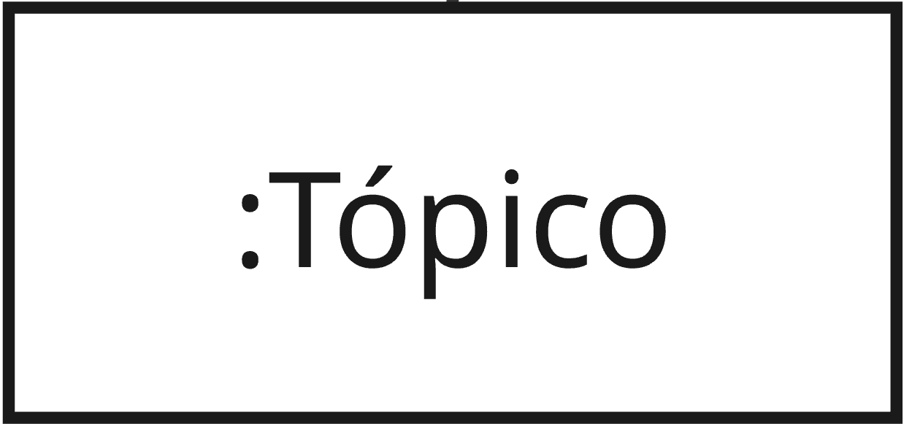
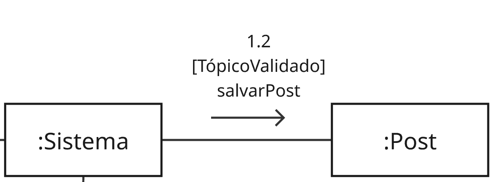
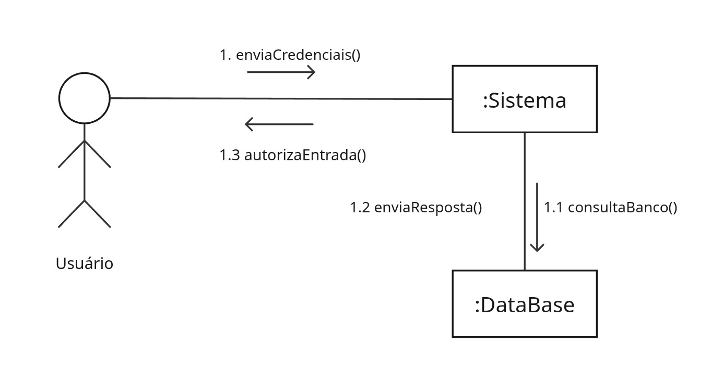
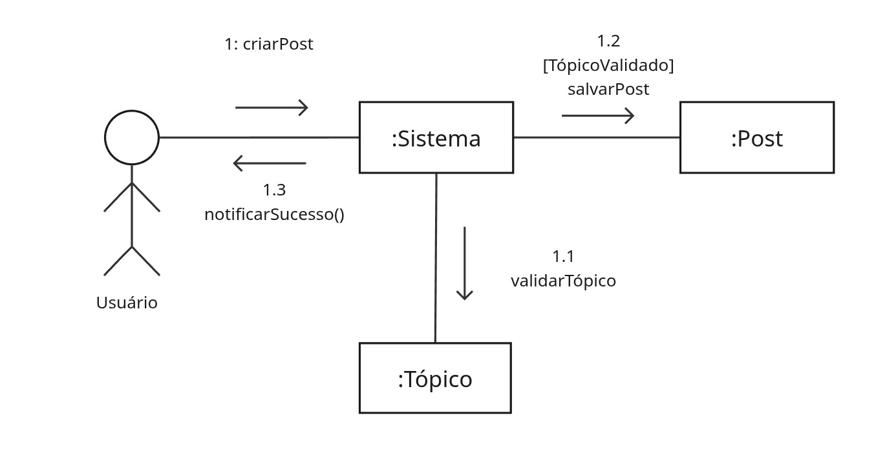
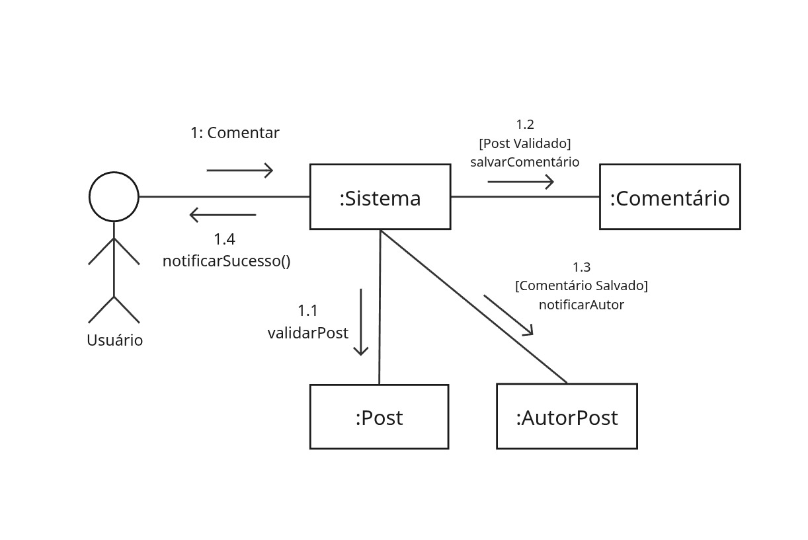

# 2.1.4 Diagrama de Comunicação (Colaboração)

## Descrição

O Diagrama de Comunicação (anteriormente conhecido como Diagrama de Colaboração) é um diagrama dinâmico da UML que ilustra a interação entre objetos e atores através da troca de mensagens sequenciais. Diferente do diagrama de sequência, que enfatiza a linha do tempo, este diagrama foca na organização estrutural dos objetos que colaboram em um cenário específico, evidenciando os caminhos de comunicação e a ordem exata de execução das rotinas.

## Objetivo

O objetivo deste artefato é modelar o comportamento dinâmico dos fluxos fundamentais do **Fórum Universitário UnB**, especificamente os cenários de Autenticação (Login), Publicação de Conteúdo (Criar Post) e Interação (Comentar). O diagrama define claramente as responsabilidades de validação, persistência e notificação distribuídas entre a controladora principal (`:Sistema`) e as entidades de domínio (`:Tópico`, `:Post`, `:Comentário`, `:DataBase`), servindo de guia direto para a implementação dos métodos no código-fonte.

## Metodologia

| Nome                 | Função                                                                                                                                                                                                                                                                                                              | Elemento                                                     |
| -------------------- | ------------------------------------------------------------------------------------------------------------------------------------------------------------------------------------------------------------------------------------------------------------------------------------------------------------------- | ------------------------------------------------------------ |
| Objeto / Ator        | Representado por retângulos contendo o nome da classe antecedido por dois pontos (ex: `:Sistema`) ou pelo símbolo de boneco palito para usuários, indicando as instâncias ativas na execução.                                                                                                                       |  |
| Conexão com Mensagem | Representado por uma linha contínua que conecta dois elementos, estabelecendo um caminho formal por onde as mensagens podem transitar durante a colaboração acompanhada de um número de sequência hierárquico (ex: 1.1, 1.2) e, opcionalmente, de uma condição de guarda entre colchetes (ex: `[Tópico Validado]`). |      |

## Diagramas de Comunicação

As figuras abaixo demonstram a colaboração entre os objetos para os cenários mapeados.

Figura 1: Diagrama de Comunicação - Autenticação (Login)

Figura 2: Diagrama de Comunicação - Criar Post (Dica)

Figura 3: Diagrama de Comunicação - Comentar

---

### Especialização dos Cenários

Abaixo estão detalhados os fluxos de mensagens correspondentes a cada um dos diagramas apresentados.

## DC01 — Autenticação (Login)

| Sequência | Origem      | Destino     | Mensagem / Ação      | Descrição                                                                               |
| :-------: | :---------- | :---------- | :------------------- | :-------------------------------------------------------------------------------------- |
|   **1**   | `Usuário`   | `:Sistema`  | `enviaCredenciais()` | O usuário submete suas informações de login pela interface.                             |
|  **1.1**  | `:Sistema`  | `:DataBase` | `consultaBanco()`    | O sistema requisita a validação das credenciais na base de dados.                       |
|  **1.2**  | `:DataBase` | `:Sistema`  | `enviaResposta()`    | A base de dados retorna o resultado da consulta (credenciais válidas ou inválidas).     |
|  **1.3**  | `:Sistema`  | `Usuário`   | `autorizaEntrada()`  | O sistema processa a resposta e concede o acesso, redirecionando o usuário para o feed. |

---

## DC02 — Criar Post (Dica)

| Sequência | Origem     | Destino    | Mensagem / Ação               | Descrição                                                                                    |
| :-------: | :--------- | :--------- | :---------------------------- | :------------------------------------------------------------------------------------------- |
|   **1**   | `Usuário`  | `:Sistema` | `criarPost`                   | O usuário envia os dados da nova publicação.                                                 |
|  **1.1**  | `:Sistema` | `:Tópico`  | `validarTópico`               | O sistema verifica se o tópico ou disciplina selecionada existe e está apto a receber posts. |
|  **1.2**  | `:Sistema` | `:Post`    | `[TópicoValidado] salvarPost` | Condicionado à validação positiva do tópico, o sistema instancia e persiste o novo Post.     |
|  **1.3**  | `:Sistema` | `Usuário`  | `notificarSucesso()`          | O sistema retorna um feedback visual ao usuário informando que a publicação foi realizada.   |

---

## DC03 — Comentar

| Sequência | Origem     | Destino       | Mensagem / Ação                       | Descrição                                                                                                           |
| :-------: | :--------- | :------------ | :------------------------------------ | :------------------------------------------------------------------------------------------------------------------ |
|   **1**   | `Usuário`  | `:Sistema`    | `Comentar`                            | O usuário envia o texto do comentário em uma publicação.                                                            |
|  **1.1**  | `:Sistema` | `:Post`       | `validarPost`                         | O sistema confere o estado do post original para garantir que ele ainda está ativo e não foi excluído/trancado.     |
|  **1.2**  | `:Sistema` | `:Comentário` | `[Post Validado] salvarComentário`    | Condicionado à validação positiva do post, o sistema cria e persiste a entidade de comentário vinculada a ele.      |
|  **1.3**  | `:Sistema` | `:AutorPost`  | `[Comentário Salvado] notificarAutor` | Após a persistência bem-sucedida, o sistema aciona o envio de uma notificação direta para o autor do post original. |
|  **1.4**  | `:Sistema` | `Usuário`     | `notificarSucesso()`                  | O sistema finaliza o ciclo atualizando a interface do usuário com a confirmação da ação.                            |

---

## DC04 — Cadastro de Usuário

| Sequência | Origem | Destino | Mensagem / Ação | Descrição |
| :---: | :--- | :--- | :--- | :--- |
| **1** | `Usuario` | `:Sistema` | `enviarDadosUsuario()` | O Usuario preenche e envia o formulário com seus dados pela interface. |
| **1.1** | `:Sistema` | `:DataBase` | `verificarMatriculaExiste()` | O sistema consulta o banco para garantir que a matrícula informada ainda não está cadastrada. |
| **1.2** | `:Sistema` | `:DataBase` | `[Matrícula Válida] salvarNovoUsuario()` | Confirmando que a matrícula está liberada, os dados do novo usuário são registrados no banco. |
| **1.3** | `:Sistema` | `Usuario` | `notificarSucesso()` | O sistema confirma a criação da conta na tela, liberando o acesso ao fórum. |
---

## Bibliografia

> Fonte: SERRANO, Milene. Arquitetura e Desenho de Software - Aula Modelagem UML Dinâmica. UnB Gama, 2026.

## Nível de Contribuição dos Integrantes

Conforme exigido, a tabela abaixo detalha a participação dos membros neste artefato específico.

| Aluno          | Participação                                                         |
| -------------- | -------------------------------------------------------------------- |
| Angélica       | Criação da documentação e Participação na realização do diagrama     |
| Diogo Oliveira | Atualização da documentação e Participação na realização do diagrama |
| Renan          | Criação e Validação dos diagramas de comunicação                     |
| João Lucas          | Criação diagrama cadastro e validação dos diagramas de comunicação 
## Histórico de versão

| Versão | Descrição                                                            |    Autor(es)    |    Data    |
| :----: | :------------------------------------------------------------------- | :-------------: | :--------: |
|  1.0   | Criação da página e Estruturação inicial do documento e metodologia. | Angélica Campos | 20/04/2026 |
|  1.1   | Atulização da Página e Adição de outros fluxos do diagrama.          | Diogo Oliveira  | 24/04/2026 |
|  1.2   | Adição de outro de diagrama e validação dos diagramas anteriores.          | João Lucas  | 24/04/2026 |