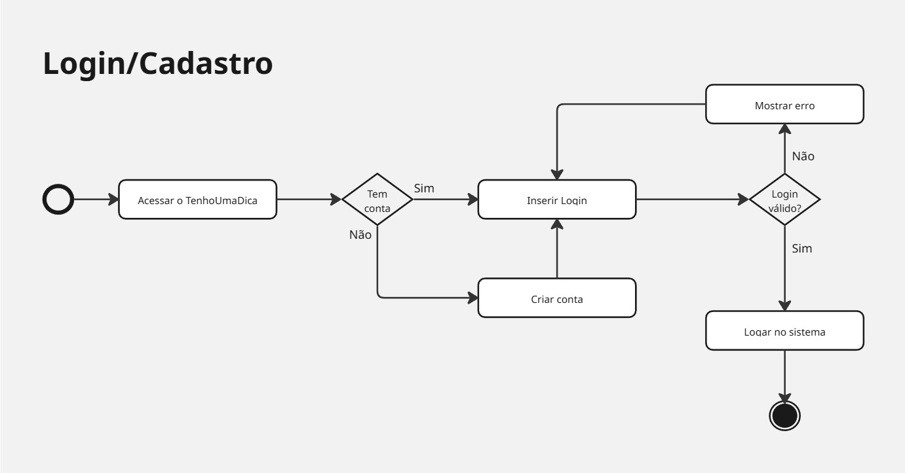
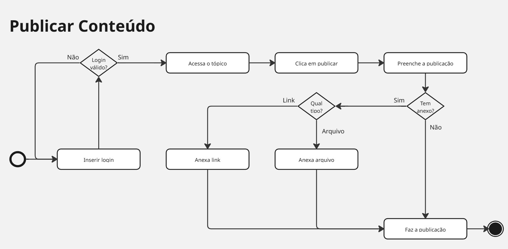
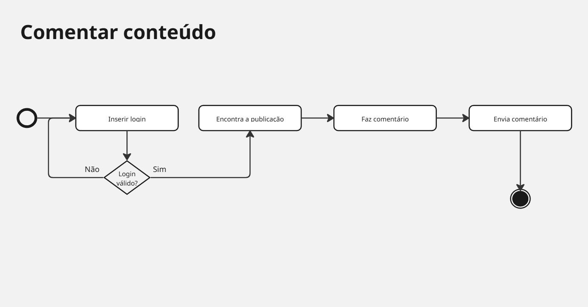
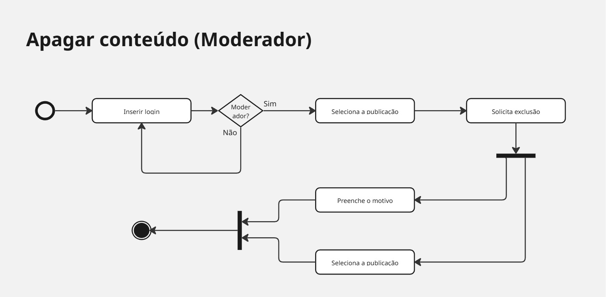
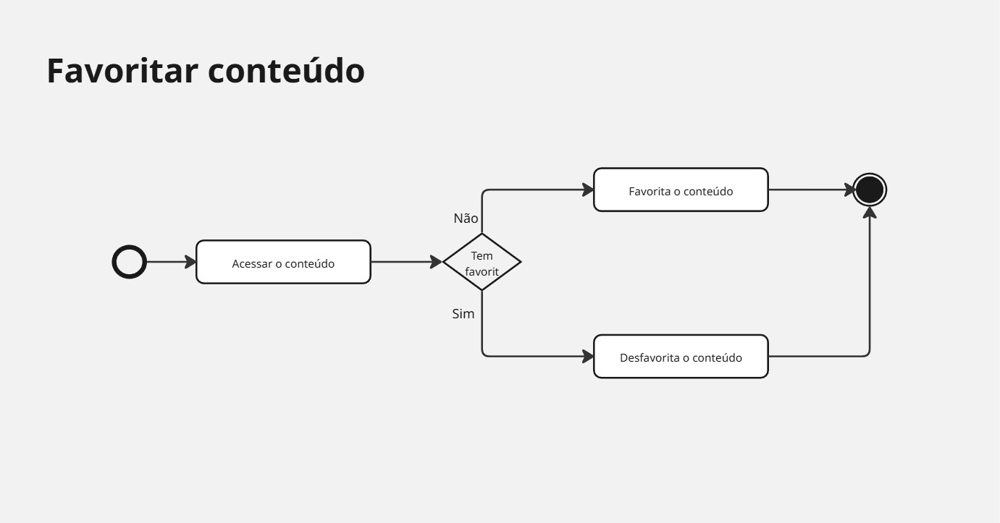

# 2.2.3. Diagrama de Atividades

##  Descrição
O Diagrama de Atividades é uma representação do comportamento dinâmico do sistema **TenhoUmaDica**. Ele descreve os fluxos de execução das funcionalidades, evidenciando a sequência de ações realizadas pelos usuários e pelo sistema, bem como decisões, bifurcações e possíveis caminhos alternativos.

Este diagrama permite visualizar, de forma clara, como os processos do sistema ocorrem na prática, funcionando como um complemento ao Diagrama de Classes ao focar no fluxo de operações.

##  Objetivo
O objetivo deste artefato é modelar os principais fluxos de interação do sistema, como autenticação de usuários, publicação de conteúdos e moderação. Através dele, buscamos representar o comportamento do sistema diante de diferentes cenários.

##  Metodologia
A modelagem seguiu a notação UML 2.5, utilizando a ferramenta Miro. O grupo aplicou conceitos de:
* **Fluxo de Controle**: Representação da sequência de execução das atividades.
* **Nós de Decisão**: Utilização de losangos para representar condições (ex: validação de login).
* **Bifurcação e Junção**: Representação de caminhos paralelos e sua sincronização.
* **Nós Inicial e Final**: Definição clara do início e término de cada fluxo.
* **Loops**: Representação de repetições no fluxo (ex: tentativa de login inválida).

### Diagramas

Figura 1: Diagrama de Atividades do Login

Figura 2: Diagrama de Atividades de Publicar Post

Figura 3: Diagrama de Atividades de Comentar

Figura 4: Diagrama de Atividades de Apagar

Figura 5: Diagrama de Atividades de Favoritar

Figura 6: Diagrama de Atividades de Publicar avaliação

#### Quadro Miro dos Diagramas
Todos os diagramas foram feitos no Miro seguindo os padrões UML:
<iframe width="768" height="496" src="https://miro.com/app/live-embed/uXjVGg_7_t0=/?focusWidget=3458764669263387371&embedMode=view_only_without_ui&embedId=773671056833" frameborder="0" scrolling="no" allow="fullscreen; clipboard-read; clipboard-write" allowfullscreen></iframe>

##  Bibliografia
* SERRANO, Milene. **Módulo Notação UML - Modelagem Estática**. UnB Gama, 2026.

##  Nível de Contribuição dos Integrantes
Conforme exigido, a tabela abaixo detalha a participação dos membros neste artefato específico.

| Aluno  | Participação|
| -- | -- |
| [Marcos Bezerra](https://github.com/marcoslbz) |  Criação da documentação e Participação na realização do diagrama (Criação da versão final)|
| [Brenda](https://github.com/Brwnds) |  Criação da versão inicial e validação da versão final|
| [Gabriel Augusto](https://github.com/gabrielaugusto23) |  Validação da versão final e adição do diagrama de atividade de Publicar avaliação|

##  Histórico de versão

| Versão | Descrição | Autor(es) | Data |
| :----: | :--- | :--- | :---: |
| 1.0 | Criação do documento | [Marcos Bezerra](https://github.com/marcoslbz) | 24/04/2026 |
| 1.1 | Adiciona mais um diagrama de atividade | [Gabriel Augusto](https://github.com/gabrielaugusto23) | 24/04/2026 |
