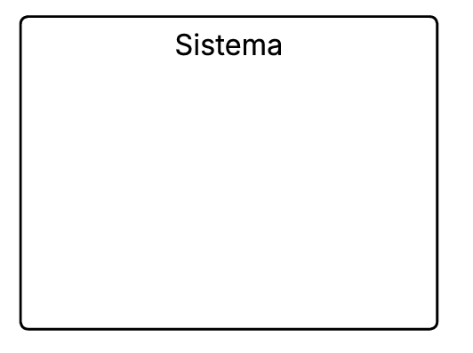
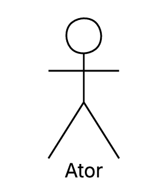
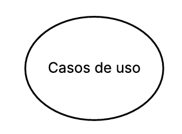
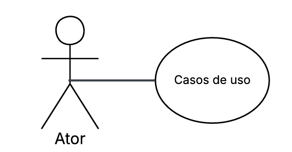
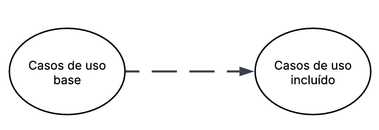
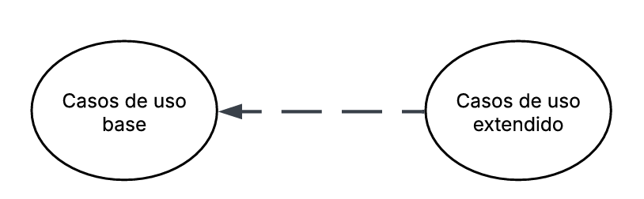
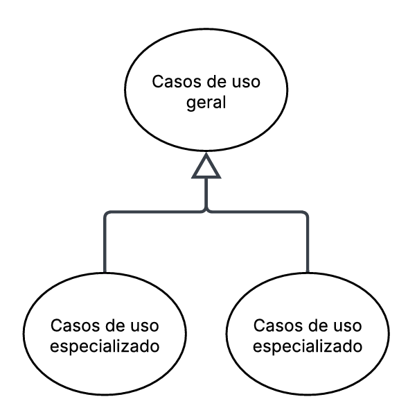

# 2.3.1 Diagrama de Classes

## Descrição

Os casos de uso descrevem como o consumidor interage com o sistema para realizar determinadas tarefas ou atingir objetivos específicos. Eles representam os diferentes cenários de uso, mostrando as ações do consumidor e as respostas do sistema em cada situação. Essa técnica ajuda a compreender melhor o comportamento esperado da aplicação e garante que todos os requisitos funcionais sejam identificados e documentados de forma clara.

## Objetivo

O objetivo dos casos de uso é detalhar o funcionamento do sistema a partir da perspectiva do consumidor, facilitando o entendimento entre desenvolvedores, analistas e stakeholders. Com eles, é possível visualizar os principais fluxos de interação, identificar possíveis falhas ou melhorias e assegurar que o sistema atenda às necessidades reais dos consumidores e aos requisitos definidos no projeto.

# Metodologia
| Nome                            | Função| Elemento|
| ------------------------------- | ------------------------------------------------------------------------------------------------------------------------------------------------------------------------------------------------------------------------------------------------------------------------------------------------------------- | ------------------------------------------------------------------------------------------- |
| Sistema                         | Representado por um retangulo o sistema define os limites do sistema, indicando o que está dentro do seu escopo e o que está fora representando o conjunto de funcionalidades que serão modeladas                                                                                                             |                                  |
| Atores                          | Representado por bonecos palito os atores representam os consumidores, pessoas ou outros sistemas que interagem com o sistema principal, executando ações ou recebendo respostas                                                                                                                              |                                        |
| Casos de Uso                    | Repesentado por uma forma geometrica oval os casos de uso descrevem as funcionalidades ou serviços que o sistema oferece aos atores sendo que cada caso de uso representa um objetivo ou tarefa que o consumidor pode realizar                                                                                |                          |
| Relacionamento de Associação    | Representado por uma linha contínua o relacionamento de associação mostra a ligação direta entre um ator e um caso de uso, indicando que o ator participa daquela funcionalidade                                                                                                                              |     |
| Relacionamento de Inclusão      | Representado por uma linha tracejada ligando um caso de uso base até um caso de uso incluído com uma seta no final. O relacionamento de inclusão indica que um caso de uso inclui obrigatoriamente outro caso de uso em seu fluxo normal de execução                                                          |       |
| Relacionamento de Extensão      | Representado por uma linha tracejada ligando um caso de uso estendido até um caso de uso base com uma seta no final. O relacionamento de extensão representa comportamentos opcionais ou condicionais, que ocorrem apenas em determinadas situações dentro de um caso de uso                                  |       |
| Relacionamento de Generalização | Representado por uma seta contínua ligando o caso de uso especializado ao caso de uso geral, com um triângulo na ponta voltado para o caso de uso geral. O relacionamento de generalização mostra a herança entre atores ou casos de uso, quando um elemento herda características ou comportamentos de outro |  |

**Tabela 1:** Elementos do diagrama de casos de uso

### Diagrama de Casos de Uso

A figura 1 demonstra o diagrama de casos de uso.

**Figura 1:**

### Especialização dos casos de uso

## UC01 — Upvote / Downvote

| Campo | Descrição |
|---|---|
| **Nome** | Upvote / Downvote |
| **Ator principal** | Aluno |
| **Pré-condição** | Aluno autenticado; dica publicada e visível no feed |
| **Fluxo principal** | 1. Aluno visualiza uma dica   2. Aluno clica em upvote ou downvote   3. Sistema registra o voto   4. Sistema atualiza o score da dica no ranking   5. Contador de votos é atualizado na tela |
| **Fluxo alternativo** | 4a. Aluno já votou nessa dica → Sistema remove o voto anterior (toggle) e atualiza o score |
| **Fluxo de exceção** | 3a. Aluno tenta votar na própria dica → Sistema bloqueia e exibe mensagem de erro |
| **Pós-condição** | Voto registrado; score da dica atualizado |

---

## UC02 — Comentar

| Campo | Descrição |
|---|---|
| **Nome** | Comentar |
| **Ator principal** | Aluno |
| **Pré-condição** | Aluno autenticado; dica publicada e visível |
| **Fluxo principal** | 1. Aluno abre uma dica   2. Aluno clica em "Comentar"   3. Sistema exibe campo de texto   4. Aluno redige o comentário   5. Aluno submete o comentário   6. Sistema valida o conteúdo   7. Sistema publica o comentário   8. Sistema notifica o autor da dica |
| **Fluxo alternativo** | 4a. Aluno anexa documento ou imagem ao comentário (`«extend»` Anexar arquivo) → Sistema valida o arquivo e associa ao comentário |
| **Fluxo de exceção** | 6a. Comentário vazio ou apenas espaços → Sistema bloqueia envio e exibe aviso   6b. Arquivo inválido ou muito grande → Sistema exibe erro e solicita novo arquivo |
| **Pós-condição** | Comentário publicado e vinculado à dica; autor da dica notificado |

---

## UC03 — Favoritar

| Campo | Descrição |
|---|---|
| **Nome** | Favoritar |
| **Ator principal** | Aluno |
| **Pré-condição** | Aluno autenticado; dica publicada e visível |
| **Fluxo principal** | 1. Aluno visualiza uma dica   2. Aluno clica em "Favoritar"   3. Sistema adiciona a dica à coleção pessoal do aluno   4. Ícone de favorito é marcado na tela |
| **Fluxo alternativo** | 2a. Dica já está nos favoritos → Sistema remove dos favoritos (toggle) e desmarca o ícone |
| **Fluxo de exceção** | 3a. Erro de conexão ao salvar → Sistema exibe mensagem de falha e orienta o aluno a tentar novamente |
| **Pós-condição** | Dica adicionada ou removida da coleção de favoritos do aluno |

## UC04 — Criar Conta

| Campo | Descrição |
|---|---|
| **Nome** | Criar Conta |
| **Ator principal** | Aluno |
| **Pré-condição** | Usuário não possui conta no fórum |
| **Fluxo principal** | 1. Aluno acessa aba de cadastro   2. Preenche o formulário com seus dados (email, matricula, etc)   3. Sistema valida as informações   4. Sistema registra a nova conta no banco   5. Sistema redireciona para a tela de login |
| **Fluxo alternativo** | - |
| **Fluxo de exceção** | 3a. Matrícula já cadastrada no sistema, sistema não cadastra exibe erro  |
| **Pós-condição** | Conta de usuário criada com sucesso |

---

## UC05 — Fazer Login

| Campo | Descrição |
|---|---|
| **Nome** | Fazer Login |
| **Ator principal** | Aluno |
| **Pré-condição** | Aluno possui conta cadastrada no sistema |
| **Fluxo principal** | 1. Aluno acessa a aba de login   2. insere credencias   3. Clica no botão de entrar   4. Sistema executa a validação das credenciais (`«include»` Autenticar Usuário)   5. Sistema libera o acesso e redireciona para o feed |
| **Fluxo alternativo** | - |
| **Fluxo de exceção** | 4a. Credenciais inválidas ou não encontradas → Sistema aciona o comportamento de erro (`«extend»` Exibir Erro de Login) avisando o aluno |
| **Pós-condição** | Aluno autenticado e com acesso às funcionalidades restritas |

---

## UC06 — Visualizar Disciplina

| Campo | Descrição |
|---|---|
| **Nome** | Visualizar Disciplina |
| **Ator principal** | Aluno |
| **Pré-condição** | Aluno autenticado |
| **Fluxo principal** | 1. Aluno busca ou seleciona uma disciplina na interface   2. Sistema carrega a página dedicada à disciplina   3. Sistema exibe as dicas, arquivos e avaliações vinculadas àquela matéria |
| **Fluxo alternativo** | 3a. Aluno decide acompanhar a disciplina de perto (`«extend»` Salvar Disciplina) → Sistema adiciona a matéria aos atalhos do perfil do aluno |
| **Fluxo de exceção** | 2a. Falha ao carregar os dados ou disciplina inativa → Sistema exibe tela de erro e botão para voltar |
| **Pós-condição** | Conteúdo da disciplina exibido para navegação |
## Bibliografia
>  Fonte: SERRANO, Milene. Módulo Notação UML - Modelagem Estática. Unb, 2025.

## Nível de Contribuição dos Integrantes
Conforme exigido, a tabela abaixo detalha a participação dos membros neste artefato específico.

| Aluno  | Participação|
| -- | -- |
|  Angélica |  Criação da documentação e Participação na realização do diagrama|
|  Brenda |  Participação na elaboração do diagrama e na criação dos casos de uso|
|  João Lucas |  Participação na elaboração do diagrama e na criação dos casos de uso|
|  Renan Ribeiro|  Participação na elaboração do diagrama e na criação dos casos de uso|
|  Gabriel Augusto |  Participação na elaboração do diagrama e na criação dos casos de uso|

## Histórico de versão

| Versão |   Descrição|                       Autor(es)                       |        Data        |
| :----: | :----------------------------------------------------------------------------------------- | :---------------------------------------------------: | :-------------------: |
| 1.1 | Criação da página.  | Angélica Campos | 20/04/2026 |
| 1.2 | Adição da descrição e objetivos do módulo de Casos de Uso.  | Angélica Campos | 20/04/2026 |
| 1.3 | Correção das imagens e validação final  | Brenda Silva | 24/04/2026 |
| 1.4 | Atualização do Diagrama de Caso de Uso  | Gabriel Augusto | 24/04/2026 |
| 1.5 | Adicona especificação de caso de uso  | João Lucas | 24/04/2026 |
| 1.6 | Ajustes na página de diagramas  | Renan Ribeiro | 24/04/2026 |
