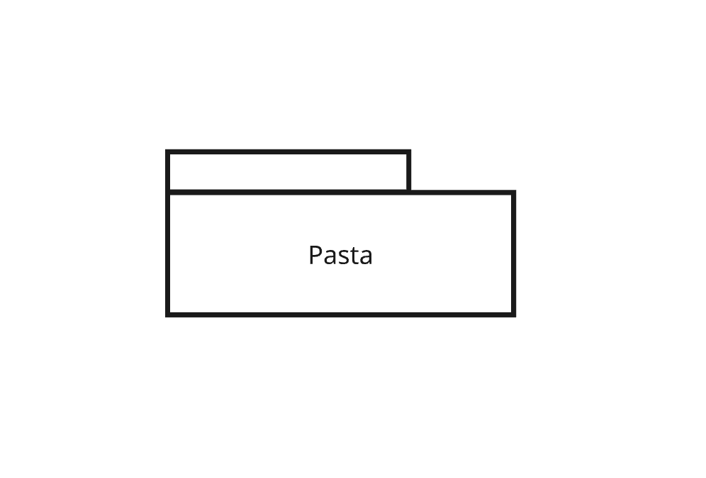
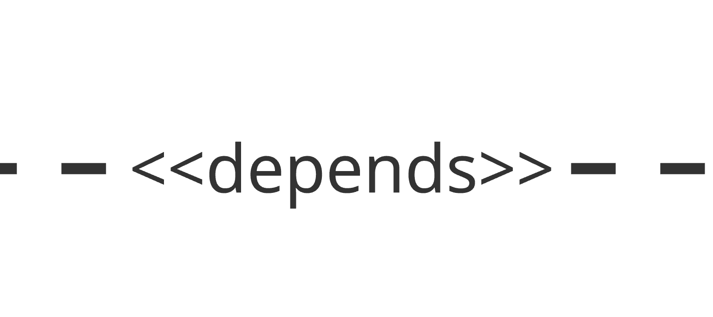
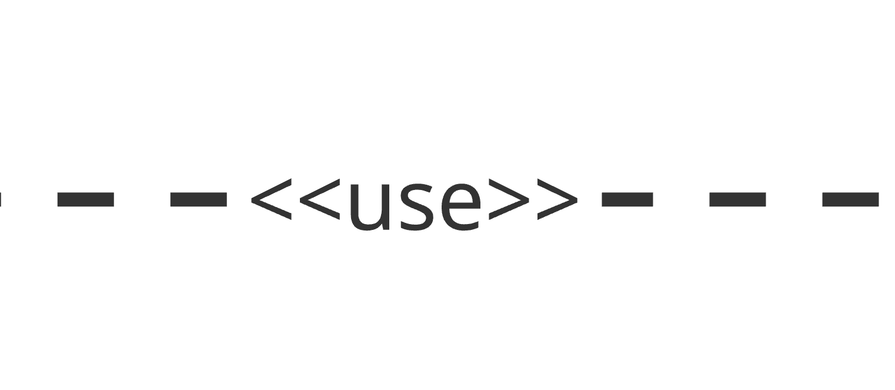
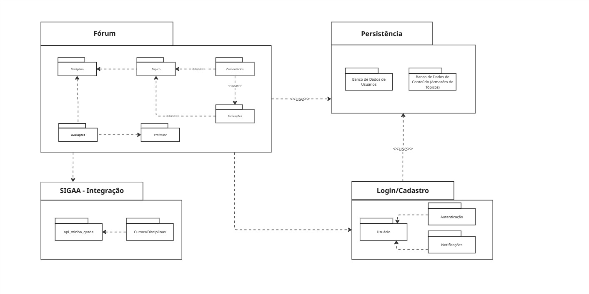

# 2.1.3 Diagrama de Pacotes

## Descrição

O Diagrama de Pacotes é um diagrama estrutural da UML utilizado para mostrar a organização e a disposição de vários elementos do modelo em forma de pacotes (módulos). Ele descreve como o sistema está dividido em agrupamentos lógicos e ilustra as dependências entre eles. Essa técnica ajuda a gerenciar a complexidade do software, facilitando a compreensão da arquitetura de alto nível e promovendo a coesão interna e o baixo acoplamento entre os módulos.

## Objetivo

O objetivo deste diagrama é fornecer uma visão macroscópica da arquitetura do **Fórum Universitário UnB**, detalhando como as regras de negócio, a persistência de dados, a gestão de identidade e as integrações externas (SIGAA) estão separadas. Com ele, a equipe de desenvolvimento consegue visualizar as fronteiras de cada módulo, entender o fluxo de dependências do código (o que precisa ser importado e onde) e garantir que o sistema seja escalável e de fácil manutenção.

## Metodologia

| Nome                          | Função                                                                                                                                                                                                                                                                                 | Elemento                                                                         |
| ----------------------------- | -------------------------------------------------------------------------------------------------------------------------------------------------------------------------------------------------------------------------------------------------------------------------------------- | -------------------------------------------------------------------------------- |
| Pacote                        | Representado por uma pasta com uma aba no canto superior esquerdo, agrupa elementos logicamente relacionados (classes, componentes ou outros pacotes), definindo um namespace (espaço de nomes) e os limites do módulo.                                                                |                          |
| Relacionamento de Dependência | Representado por uma linha tracejada com uma seta aberta na ponta e o estereótipo `«depends»`. Indica que um pacote requer a funcionalidade, o código ou a compilação de outro pacote para funcionar corretamente. Uma mudança no pacote fornecedor pode impactar o pacote dependente. |  |
| Relacionamento de Uso         | Representado por uma linha tracejada com o estereótipo `«use»`. Indica uma dependência de utilização, onde elementos internos de um pacote interagem diretamente com os elementos de outro para executar suas rotinas.                                                                 |              |

**Tabela 1:** Elementos do diagrama de pacotes

### Diagrama de Pacotes

A figura 1 demonstra a divisão organizacional do sistema.

Figura 1: Diagrama de Pacotes do Fórum Universitário UnB

---

### Especialização dos Pacotes

Abaixo estão descritos os principais pacotes do sistema e suas responsabilidades arquiteturais.

## PC01 — Fórum (Core)

| Campo                     | Descrição                                                                                                                                                                                    |
| ------------------------- | -------------------------------------------------------------------------------------------------------------------------------------------------------------------------------------------- |
| **Nome**                  | Fórum                                                                                                                                                                                        |
| **Responsabilidade**      | Módulo central contendo as regras de negócio de interação, publicação e acadêmicas.                                                                                                          |
| **Pacotes Internos**      | `Disciplina`, `Tópico`, `Avaliações`, `Professor`, `Comentários`, `Interações`.                                                                                                              |
| **Dependências Internas** | - `Tópico` depende de `Disciplina`   - `Professor` depende de `Avaliações`   - `Comentários` utiliza (`«use»`) `Tópico`   - `Interações` utiliza (`«use»`) `Tópico` e `Comentários` |
| **Dependências Externas** | Depende de `SIGAA - Integração`, `Login/Cadastro` e `Armazenamento de Informações`.                                                                                                          |

---

## PC02 — Login/Cadastro (Identidade)

| Campo                     | Descrição                                                                                     |
| ------------------------- | --------------------------------------------------------------------------------------------- |
| **Nome**                  | Login/Cadastro                                                                                |
| **Responsabilidade**      | Gerenciar o acesso seguro, a criação de contas e o perfil dos estudantes na plataforma.       |
| **Pacotes Internos**      | `Usuário`, `Autenticação`, `Notificações`.                                                    |
| **Dependências Internas** | - `Autenticação` depende de `Usuário`   - `Notificações` depende de `Usuário`              |
| **Dependências Externas** | Depende diretamente de `Armazenamento de Informações` para persistir e consultar credenciais. |

---

## PC03 — SIGAA - Integração

| Campo                     | Descrição                                                                                                                          |
| ------------------------- | ---------------------------------------------------------------------------------------------------------------------------------- |
| **Nome**                  | SIGAA - Integração                                                                                                                 |
| **Responsabilidade**      | Camada de serviço responsável por se comunicar com a API da universidade para sincronizar as disciplinas e os vínculos dos alunos. |
| **Pacotes Internos**      | `api_minha_grade`, `Cursos/Disciplinas`.                                                                                           |
| **Dependências Internas** | - `Cursos/Disciplinas` depende de `api_minha_grade` para receber os dados formatados.                                              |
| **Dependências Externas** | Depende do módulo `Login/Cadastro` para vincular os dados acadêmicos ao usuário correto no sistema.                                |

---

## PC04 — Armazenamento de Informações (Persistência)

| Campo                     | Descrição                                                                                                                |
| ------------------------- | ------------------------------------------------------------------------------------------------------------------------ |
| **Nome**                  | Armazenamento de Informações                                                                                             |
| **Responsabilidade**      | Módulo de infraestrutura e banco de dados isolado para garantir a persistência segura de todo o estado da aplicação.     |
| **Pacotes Internos**      | `Banco de Dados de Usuários`, `Banco de Dados de Conteúdo (Armazém de Tópicos)`.                                         |
| **Dependências Internas** | Nenhuma. Trabalham como repositórios independentes.                                                                      |
| **Dependências Externas** | Módulo base (folha). Não depende de nenhum outro pacote do diagrama, servindo como base para `Fórum` e `Login/Cadastro`. |

## Bibliografia

> Fonte: SERRANO, Milene. Módulo Notação UML - Modelagem Estática e Organizacional. UnB, 2026.

## Nível de Contribuição dos Integrantes

Conforme exigido, a tabela abaixo detalha a participação dos membros neste artefato específico.

| Aluno                                                | Participação                                |
| ---------------------------------------------------- | ------------------------------------------- |
| [Diogo Oliveira](https://github.com/Diogo-Olivv)     | Criação e Validação do diagrama de pacotes. |
| [João Gabriel](https://github.com/JoaoComTil)        | Criação e Validação do diagrama de pacotes. |
| [Gabriel Maciel](https://github.com/GabrielMacielBR) | Criação e Validação do diagrama de pacotes. |
| [Felipe Rodrigues](https://github.com/felipeJRdev)   | Validação e ajuste no diagrama de pacotes.  |

## Histórico de versão

| Versão | Descrição                                 |                     Autor(es)                      |    Data    |
| :----: | :---------------------------------------- | :------------------------------------------------: | :--------: |
|  1.0   | Criação da página do Diagrama de Pacotes. |  [Diogo Oliveira](https://github.com/Diogo-Olivv)  | 24/04/2026 |
|  1.1   | Ajuste na contribuição                    | [Felipe Rodrigues](https://github.com/felipeJRdev) | 24/04/2026 |
